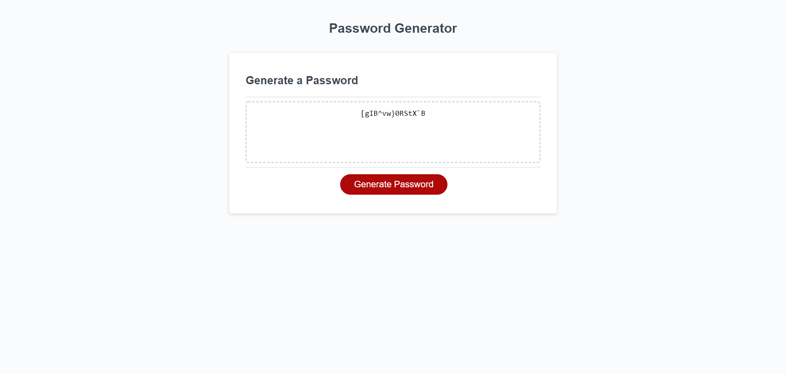

-- JavaScript Password Generator

-- Description:  The goal of this project was to create a random password generator that allowed users to generate a completly random password through the push of a button.  
Users are able to dictate their desired length of the password and also choose whether or not Uppercase, Lowercase, Numbers or Symbols are included in their password.  Upon answering the prompts,
the user will receive a set of characters from an array that will be displayed in box with a dashed border (see below image for refernce).

-- Usage:  This deployed page will allow users to create a completly random set of characters that can be used as passwords.  Selecting the password length and the characters used help create passwords
that are more compliant with potential password regulations.  

Image of working webpage:

